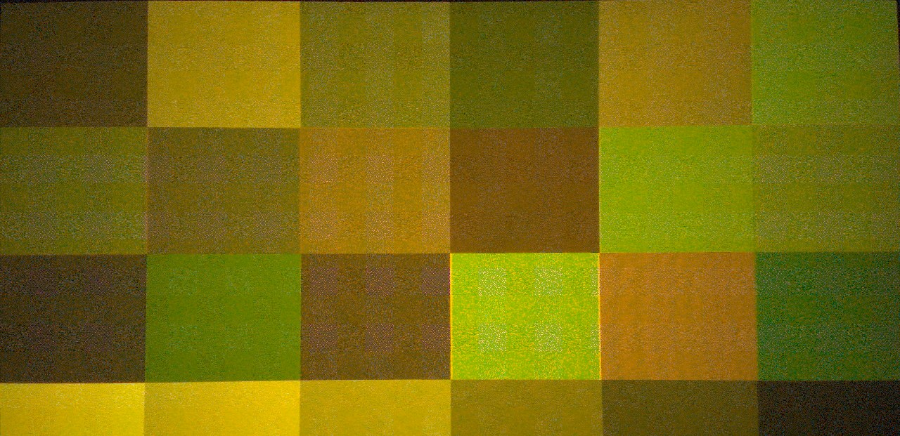
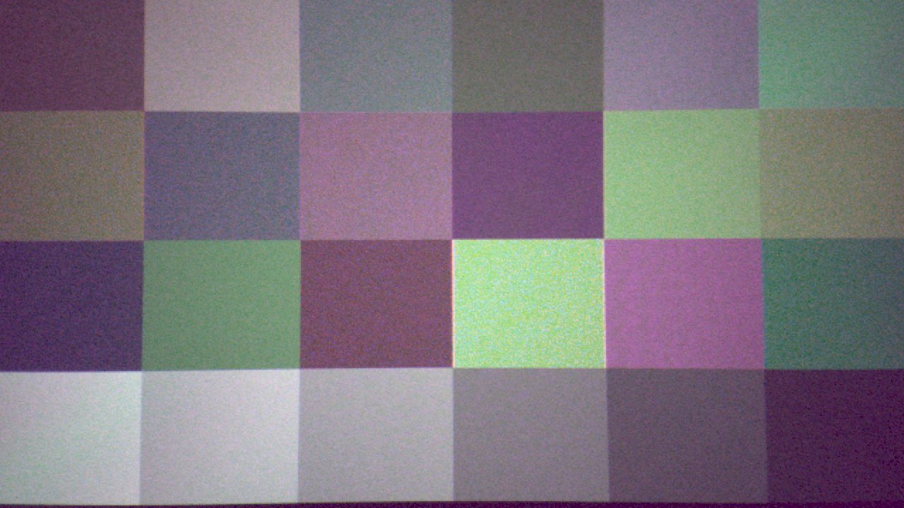
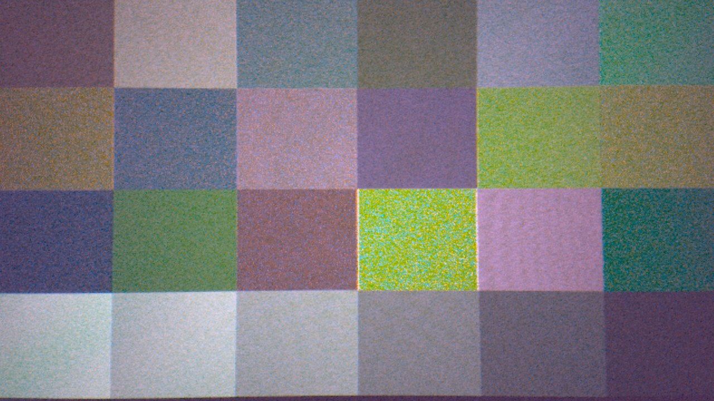
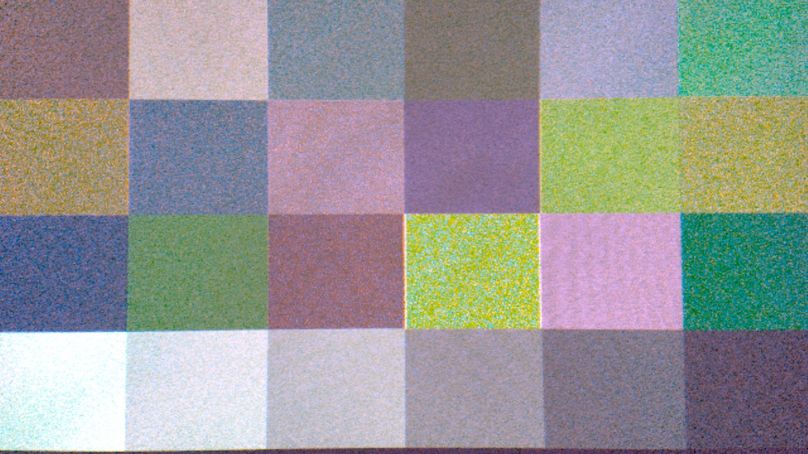

# Dell Latitude 7320 Detachable — front camera on Linux

The user-facing 5MP camera on the Dell Latitude 7320 Detachable has never
worked on Linux. This repository makes it work: kernel patches, a libcamera
patch and tuning file, the local configuration needed to reach it from a
browser, and the diagnostic scripts used to find all of it.

Two long-standing reports ask for this hardware:
[intel/ipu6-drivers#24](https://github.com/intel/ipu6-drivers/issues/24) (2022)
and [#402](https://github.com/intel/ipu6-drivers/issues/402) (2025), the latter
blocked waiting for "OV5678 sensor specifications (clock rates, power
requirements)".

## Before you start

**Check this is actually your machine.** The board data matches on DMI strings, so
it does nothing at all on anything else:

```sh
cat /sys/class/dmi/id/product_name        # must print: Latitude 7320 Detachable
```

Note "Detachable". There is also a **Dell Latitude 7320 laptop**, a different
machine with no IPU6, and none of this applies to it.

**What you get:** `/dev/video0` at 1280x720, roughly 28 fps, usable in Firefox,
Chromium and anything else that opens a normal camera device. Colour is
reasonable, not excellent - see [Known limitations](#known-limitations).

**What it touches.** Out-of-tree kernel modules via DKMS, so they rebuild when
your kernel updates. A libcamera build in `/usr/local` - **nothing under `/usr` is
modified**, and your distribution's libcamera is left alone. Three systemd units.
Two files in `/etc/modprobe.d`. All of it is listed in
[Uninstalling](#uninstalling), and all of it is reversible.

**Budget an hour, and expect two reboots.** Most of that is libcamera compiling.

**If you have never done this before**, the two things worth knowing: DKMS builds
kernel modules against your running kernel and rebuilds them automatically on
kernel upgrades, and `dracut`/`update-initramfs` regenerate the early-boot image -
needed here because of a firmware loading race. You do not need to understand the
camera stack to follow [Installing](#installing); you do need to run the steps in
order, because each one depends on the last.

## Quick start: just make the camera work

Follow this if you want a working camera and nothing else. It stops before any
colour work, so **the picture will have a heavy yellow cast and visible blocky
patterning** - that is normal here and is explained in
[The short version](#the-short-version). Fixing it is the rest of this document.

> **This installs kernel modules. Read this paragraph.**
>
> Steps 3 and 4 build and load out-of-tree kernel modules and regenerate your
> early-boot image. On the wrong machine they do nothing useful, and a broken
> initramfs can leave a system that will not boot. Nothing here is exotic - it is
> DKMS and `dracut`, the same mechanism graphics and wifi drivers use - but if
> this is a machine you cannot afford to have down for an evening, take a backup
> or a snapshot first. Every change is listed in
> [Uninstalling](#uninstalling) and is reversible. Your distribution's own
> libcamera is never touched.

**1. Confirm this is the right machine.** Must print `Latitude 7320 Detachable`:

```sh
cat /sys/class/dmi/id/product_name
```

If it prints `Latitude 7320` without "Detachable", stop - that is a different
laptop with no IPU6 and none of this applies.

**2. Install what is needed.** All from the Ubuntu archive:

```sh
sudo apt install dkms build-essential "linux-headers-$(uname -r)" \
                 v4l2loopback-dkms v4l-utils gstreamer1.0-plugins-good
```

**3. Build and install the kernel modules:**

```sh
git clone https://github.com/githomeserver/latitude-7320-camera.git
cd latitude-7320-camera
sudo tools/dkms-install.sh
```

It refuses to run on any other model. There are no module parameters to set - if
an older attempt left `/etc/modprobe.d/int3472-dell7320.conf` behind, delete it.

**4. Regenerate the boot image and reboot.** This is not optional: without it the
IPU6 asks for its firmware before the root filesystem is available, and the
camera fails at boot roughly half the time.

```sh
sudo dracut --force --kver "$(uname -r)"     # Ubuntu 26.04
# older Ubuntu: sudo update-initramfs -u -k "$(uname -r)"
sudo reboot
```

**5. Check the kernel side came up:**

```sh
tools/check-camera.sh
```

Every line should say `PASS`. If the sensor line fails, the camera is not
powered - see [Diagnostics](#diagnostics); do not continue to step 6, because it
cannot help.

**6. Give applications a normal camera device.** Browsers cannot use the IPU6's
raw nodes, so this feeds a v4l2loopback device they can open:

```sh
sudo tools/install-camera-service.sh
```

**7. Test it.** Open <https://webcamtests.com> or your video-call app and pick
**Virtual Camera**.

```sh
# or from the terminal:
gst-launch-1.0 v4l2src device=/dev/video0 ! videoconvert ! autovideosink
```

You should see a live picture, heavily yellow-cast. **That means everything
worked** - this is what the camera looks like before any of the colour work:



That is a standard colour chart on screen. Every patch is dragged toward
yellow-brown and the blue and purple ones are unrecognisable, because the 4x4
RGB-IR mosaic is being read as ordinary Bayer: **the channel labelled blue is
actually infrared**, which is dark. On the white patch it reads **18** where it
should read about 180.

**To fix the colour**, continue with [Installing](#installing) from step 3 - it
builds a patched libcamera into `/usr/local` and adds the RGB-IR conversion, lens
shading and denoise. Budget an hour, mostly compiling.

**To undo everything:**

```sh
sudo tools/install-camera-service.sh revert
sudo dkms remove "camera-dell7320/$(dkms status camera-dell7320 | head -1 | cut -d/ -f2 | cut -d, -f1)" --all
sudo dracut --force --kver "$(uname -r)"
sudo reboot
```

## The short version

**`ov5675.c` drives it — but the sensor is RGB-IR, and no Linux driver can
describe that yet.**

ACPI names the part `OVTI5678` and no driver has ever claimed that ID. Once
powered it reports chip id `0x005675` at register `0x300a`, and every value
`ov5675.c` is sensitive to agrees:

| measured on this machine | `ov5675.c` |
|---|---|
| chip id `0x005675` @ `0x300a` | `OV5675_CHIP_ID 0x5675` |
| 2 CSI-2 data lanes (ACPI `L0NL`) | `OV5675_DATA_LANES 2` |
| 19.2 MHz MCLK (ACPI `L0CK`) | `OV5675_XVCLK_19_2` |
| 5MP front camera | 2592×1944 |

Three of those came from ACPI *before* the sensor was ever powered on. So no
new sensor driver and no reverse-engineered register tables were needed to make
it **stream** — which is what the problem had looked like for three years.

**Colour is a different story.** This is not a plain OV5675. It carries a 4×4
RGB-IR colour filter array, one pixel in four being infrared
([defect 5](#5-the-sensor-is-rgb-ir-not-bayer-at-all-kernel--root-cause)):

```
G I G I
R G B G
G I G I
B G R G
```

Read as the 2×2 Bayer every Linux tool assumes, the "blue" channel is **pure
infrared** and the "red" channel interleaves real red with real blue. That one
fact explains every colour problem documented below, and it cannot be fixed in
a driver: **mainline V4L2 has no RGB-IR media bus code at all.**

An earlier version of this file said flatly "it is an OV5675". That was wrong,
and it was wrong for an instructive reason — every measurement behind it was
taken through the sensor's *binned* mode, which averages IR pixels together
with colour ones and destroys the very structure being looked for.

## Status

Working: 1280x720 at ~28 fps in Firefox, Chromium, and anything else that opens
`/dev/video0`. The 4x4 RGB-IR mosaic is now handled properly by a pre-pass
rather than being misread as Bayer, lens shading is corrected from a map measured
on this unit, and a temporal denoise runs on the mosaic.

| | before | now |
|---|---|---|
| works at all | no driver claimed the ACPI id | 1280x720 at ~28 fps |
| mosaic | 4x4 RGB-IR read as 2x2 Bayer | converted to Bayer up front |
| white balance (linear R/G) | 0.372 | ~1.00 |
| red and blue | transposed | correct |
| corner brightness (linear, vs centre) | 0.28 | **1.00** |
| temporal noise, still scene | baseline | **2.0x cleaner** |
| CPU while streaming | 104% of one core | **78%** |
| CPU with nothing watching | 104% of one core | **5.5%** |
| CPU temperature, idle | 99 C | **43 C** |

Measured on this machine; scene-dependent figures move with the scene.

**What is still not good: saturation.** The sensor separates colour far less than
sRGB expects - measured on a colour chart, the dominant/next-channel ratio falls
short by **6.8x on red and 4.4x on blue**. A matrix that fully corrects that
needs off-diagonals of +-3 and amplifies noise 5.3x, against 1.9x for the matrix
that ships. On a sensor that is already noise limited that is the wrong trade, so
the shipped matrix is deliberately a compromise. See
[Known limitations](#known-limitations).

The rear OV8856 is **not** addressed here.

## What was actually broken

Eight independent faults across three layers. Each had to be fixed before the
next became visible, which is why this took a while - and why the diagnostic
scripts in `tools/` may be more useful to you than the patches.

### 1. IPU6 firmware never loaded (kernel)

`MODULES=most` pulled `intel_ipu6` into the initrd, so it probed at t≈1.07 s —
before the root filesystem was mounted at t≈2.66 s. `intel/ipu/ipu6_fw.bin` did
not exist yet, probe failed `-ENOENT`, and PCI probe failures are not retried.

Fixed by regenerating the initrd with dracut, whose hostonly default does not
include it: `sudo dracut --force --kver "$(uname -r)"`. **No `omit_drivers`
configuration is needed** — the plain rebuild is enough.

### 2. No TPS68470 board data (kernel)

```
int3472-tps68470 i2c-INT3472:07: error -ENODEV: No board-data found for this model
```

Both sensors declare an ACPI `_DEP` on the control logic, so until the PMIC
driver probes successfully, **no i²c client is created for either sensor at
all**. Nothing can bind to a device that does not exist.

The rail assignment matches the Dell 7212 and Dell 5290 — VSIO/AUX1/AUX2 feeding
avdd/dvdd/dovdd — but **the GPIO mapping does not**. Reset is on `tps68470-gpio`
**5**, active low, and there is **no powerdown pin at all**: `ov5675.c` requests
only `"reset"`, so any `"powerdown"` lookup is dead code. Pin 3, which the 7212
and 5290 use for reset, is inert on this board.

An earlier version of this file said reset on 3 and powerdown on 4, taken from
that prior art and confirmed by the camera working. That was wrong, and wrong
instructively: the sensor probes with **no pin assigned at all**, because the
real reset line sits released by default. A wrong mapping is therefore invisible
here. What establishes the mapping is making the probe *fail* on demand — hold
line 5 low and the sensor stops identifying; hold line 3 low and nothing
happens. Verified on two physical units, three trials per condition.
Note the control logic here enumerates as `INT3472:07`, not `:05` as on the
other Dell models — the lookup matches on DMI *and* device name, so this must
be exact.

→ `kernel-patches/0001-*`

### 3. No driver claimed OVTI5678, and ipu-bridge did not know it (kernel)

Adding the ACPI ID to `ov5675.c` and an `IPU_SENSOR_CONFIG("OVTI5678", 1,
450000000)` entry to `ipu-bridge.c` is all that was required. 450 MHz is
`OV5675_LINK_FREQ_450MHZ`, the only link frequency that driver supports.

→ `kernel-patches/0002-*`, `kernel-patches/0003-*`

### 4. Browsers could not reach it (system configuration)

The kernel side working is not enough. Applications open a plain V4L2 device, and
the IPU6's 64 `/dev/videoN` nodes are raw Bayer sinks that cannot serve one. The
usable device is `/dev/video0`, a v4l2loopback that something must feed.

The obvious candidate, `v4l2-relayd`, was tried and abandoned:

- It shipped `VIDEOSRC=icamerasrc`, Intel's closed CamHAL, which has no tuning
  data for this sensor. It falls back to an AR0234 tuning file and fails in a loop
  (`CamHAL[ERR] Input stream was missing`), so the loopback exists but nothing
  ever writes to it. `libcamerasrc` works instead.
- Its service sandbox permits only `char-drm/media/intel-ipu6-psys/psys/
  video4linux`, but libcamera's software ISP needs `/dev/dma_heap/system`
  (char **248**). Without it: `Could not open any dma-buf provider` →
  `disabling software debayering`, and no frames. **Testing the pipeline by hand
  does not reproduce this** - it only fails inside the unit.
- Even once working it was the bottleneck. Measured on this machine with the same
  work either side: **1.3 fps through the relay against 29.9 fps** feeding the
  loopback directly. The relay bridges two GStreamer pipelines through
  appsink/appsrc, and that is where the frames went. This matters beyond frame
  rate - the CPU pre-pass was written off as "a dead end on this hardware" on the
  strength of numbers that were actually measuring the relay.

So the relay is gone. `install-camera-service.sh` runs one pipeline straight into
the loopback, and `ov5678-ondemand.service` starts it only while something is
watching. See [On-demand](#on-demand-and-why-it-needs-a-placeholder).

Also constrain `libcamerasrc` to the target size. Left alone it asks for the
sensor's full-resolution mode; constrained to 1280x720 the pre-pass window
shrinks and it processes fewer pixels per frame.

→ `tools/install-camera-service.sh`, `tools/fix-browser-camera.sh`

### 5. The sensor is RGB-IR, not Bayer at all (kernel) — ROOT CAUSE

**Confirmed 2026-08-09 and it supersedes the GBRG explanation below.** Intel's
own pipeline configuration for this exact module - `graph_settings_OV5678_`
`0BF501T3_TGL.xml`, matching this machine's ACPI `_DDN` - declares
`bayer_order="GIGI_RGBG_GIGI_BGRG"` and `sensor_type="RGB_IR"`. The rear OV8856
in the same directory says plain `GRBG`.

```
G I G I        one pixel in four is INFRARED
R G B G
G I G I
B G R G
```

Measured directly at 2592x1944 on a red subject (`tools/check-rgbir.sh`),
black-level corrected, 10-bit counts:

```
G  8 positions   mean 116.1   spread 3.4
I  4 positions   mean  14.2   spread 0.1
R  2 positions   mean  89.7   spread 0.5
B  2 positions   mean  73.3   spread 0.1
```

Positions a 2x2 Bayer calls one channel differ by **18%**; the IR pair agrees
to **0.4%**. Not lens shading - the positions interleave at pixel level across
the same sampling area.

Read as 2x2 GBRG, which is what the patched driver declares:

| declared channel | what it actually is |
|---|---|
| green | green |
| **blue** | **pure infrared, at every position** |
| **red** | real red and real blue, checkerboarded |

That is the root cause of the whole colour effort: the ~4.9x blue gain was
amplifying infrared at 12% of green; "blue" was anti-correlated with subject
blue because infrared is (yellow reflects strongly in NIR); the CCM's blue row
was unfittable because the channel was not a colour channel; and the red
channel is an R/B spatial average, which is close to grey by construction.

**Binning destroys the mosaic.** Intel lists exactly one mode, 2592x1944, where
the plain-Bayer OV8856 gets several. Our pipeline runs the binned 1296x972
mode, which averages IR in with colour. Any RGB-IR work must be full-res.

Fixing this properly needs an RGB-IR demosaic, which libcamera's software ISP
does not have - it handles 2x2 mosaics only. Note that dropping the IR rows
does not leave a Bayer pattern either: rows 1 and 3 are `R G B G` and `B G R G`,
with red and blue in the same row.

### 5b. The GBRG workaround (superseded, still what ships here)

`ov5675.c` hardcodes `MEDIA_BUS_FMT_SGRBG10_1X10` in three places. On this board
red and blue are transposed, consistent with the module being mounted 180
degrees - rotating a GRBG array by 180 gives GBRG:

```
G R                G B
B G   --180-->     R G
```

Proven by capturing one raw frame and demosaicing it both ways
(`tools/demosaic-both-ways.sh`): a known-red Kmart logo renders red under GBRG
and blue under GRBG. After patching, two independent things fell into place -
the AWB gains mirrored (red 6.01 -> 1.46, blue 1.54 -> 4.90) and the estimated
colour temperature went from 6752 K to **3139 K**, i.e. from implausible
daylight to correct warm-indoor.

**A warning for anyone testing this.** The obvious check - confirming the two
green CFA positions agree - *cannot detect this fault*. GRBG and GBRG both put
greens at (0,0) and (1,1), so that test only rules out RGGB/BGGR. An R/B swap is
also invisible to grey-world AWB, because balancing to neutral works whichever
way the channels are labelled. Greys look perfect while every colour is wrong.
It cost a lot of time here.

Not upstreamable as-is: changing the code unconditionally would break every
ov5675 mounted the other way up. Upstream this needs a board-specific key. There
is also a genuine latent bug alongside it - the driver never adjusts the mbus
code when H/V flip are applied.

### 6. A strong cyan cast (libcamera)

Three further defects, each masking the next. On lit white paper, in **linear**
light (undo the sRGB transfer before averaging — comparing gamma-encoded ratios
against linear sensor ratios badly understates the error):

```
stock libcamera 0.7.0             R/G 0.372   B/G 0.897    saturation 34%
+ remove the AWB 4.0 gain clamp   R/G 0.551   B/G 0.901
+ tuning file with black level    R/G 0.562   B/G 0.905
+ LIBCAMERA_SOFTISP_MODE=cpu      R/G 1.091   B/G 0.997    saturation 5.1%
```

- **The AWB caps colour gains too low.** 0.7.0 clamps at a hardcoded 4.0; this
  sensor needs 6.1, so red sat pinned at exactly 4 on every frame while blue
  computed normally. → `libcamera-patch/` (applied to the local 0.7.0 build).
  Master does not fix this: the hardcoded clamp went away in `d5d00b9c3c5d`,
  but `AwbAlgorithmBase::process()` clamps to `gainMax_`, derived from the
  `AwbAlgorithm<UQ<2, 8>>` the simple IPA instantiates — a ceiling of 3.996.
  → `upstream-libcamera/0001-ipa-simple-awb-Widen-*` widens it to `UQ<3, 8>`.
- **The black level is guessed from the scene** when no tuning file exists —
  the 2nd percentile of the luminance histogram — and the AWB subtracts that
  guess before computing gains. Here the pedestal (64/1023) is about twice the
  red signal, so the error lands almost entirely on red. Pinning it took the
  computed gain from 4.79 to 6.01, against 6.13 predicted from raw
  measurements. → `libcamera/ov5675.yaml`
- **The EGL debayer does not apply the AWB gains.** Same scene, same build,
  only `LIBCAMERA_SOFTISP_MODE` differing: GPU `R/G 0.552`, CPU `R/G 1.091`.
  Not sensor-specific; it affects any camera on the software ISP with GPU
  acceleration, which is the default.

  **The mechanism is not known, and three plausible ones are ruled out.** An
  earlier version of this file claimed the shader has no gains uniform. That is
  wrong. `debayer_egl.cpp:475` uploads `params.combinedMatrix` as the `ccm`
  uniform; `awb.cpp:46` folds the gains into that matrix unconditionally; the
  apparently-wrong `GL_FALSE` on row-major data is deliberately compensated by
  the shader indexing the matrix by hand (`bayer_unpacked.frag:173`, with a
  comment block explaining it); and the EGL path does generate statistics. The
  one real asymmetry found is that `DebayerCpu` branches on `ccmEnabled` while
  `DebayerEGL` takes it as `[[maybe_unused]]` and always uses `combinedMatrix`.
  Installing an identity `Ccm` does not fix it either.

  Because the workaround is a colour correction, not `SOFTISP_MODE=cpu`, see
  [Colour tuning](#colour-tuning). → `tools/try-cpu-isp.sh`

- **The gains are floored at 1.0 as well as capped**, by
  `gainMin_ = std::max(Q::TraitsType::min, 1.0f)` (`libipa/awb.h:120`), even
  though `UQ<2, 8>::min` is 0.0. Grey world holds green at 1.0, so a sensor
  whose red is *stronger* than green would need a red gain below 1.0 and
  cannot express it. Not reproduced here — this sensor is red-weak, the
  opposite case — so it is reported as an observation from source, with no
  patch. Reported, not fixed.

### 7. `Saturation` is silently inert without a CCM (libcamera)

`Adjust` implements `controls::Saturation` by writing `combinedMatrix`, but
both the control's registration and its application are gated on
`context.ccmEnabled` (`adjust.cpp:33` and `:104`). That flag is set in exactly
one place, `Ccm::init` (`ccm.cpp:39`), which runs only if the tuning file
defines a `Ccm` algorithm.

So with no `ccms` section, `libcamerasrc saturation=2.0` is accepted and does
nothing at all, with no warning. Adding an identity `Ccm` makes the same
control start working. → `tools/install-ccm.sh`, `tools/set-saturation.sh`

## Installing

Ubuntu 26.04, kernel 7.0.0-29, libcamera 0.7.0-1ubuntu2. Adapt as needed.

`build-libcamera.sh` builds whatever `apt-get source libcamera` gives you, so it
tracks your distro rather than pinning a release.

Prerequisites - all in the Ubuntu archive, no OEM PPA required:

```sh
sudo apt install dkms build-essential "linux-headers-$(uname -r)" \
                 v4l2loopback-dkms v4l-utils \
                 gstreamer1.0-plugins-good python3-pil
```

`v4l2-relayd` is **not** needed. It is replaced by `install-camera-service.sh`,
which feeds the loopback directly - the relay's appsink/appsrc bridge throttled
the pipeline to 1.3 fps against 29.9 for the same work.

```sh
# 1. kernel modules via DKMS: int3472 board data, ov5675 ACPI id, ipu-bridge entry
#    module/ is the git-am output of the submitted v2 patch, so what you run here
#    is byte-for-byte what went upstream. It takes NO module parameters; if an
#    older install left /etc/modprobe.d/int3472-dell7320.conf behind, remove it or
#    the module will refuse to load with "unknown parameter".
sudo tools/dkms-install.sh
sudo dracut --force --kver "$(uname -r)"      # also fixes the IPU6 firmware race
sudo reboot

# 2. verify the kernel side
tools/check-camera.sh          # expects "Connected 2 cameras" and ov5675 in the graph

# 3. patched libcamera into /usr/local; nothing under /usr is touched
sudo tools/build-libcamera.sh deps
sudo tools/build-libcamera.sh build
sudo tools/build-libcamera.sh install
sudo tools/install-tuning.sh

# 4. colour matrix (per-camera - see "Colour tuning" before copying numbers)
sudo tools/install-ccm.sh 1.8101,-0.3453,-0.4648,0.3076,0.4034,0.2890,-0.1110,-0.6389,1.7499

# 5. lens shading, measured from YOUR unit: hold plain white paper over the lens
sudo tools/measure-lens-shading.sh --raw     # writes data/lens-shading-measured-raw.bin

# 6. the camera service, which also feeds /dev/video0 for browsers
sudo SHARPNESS=0.5 DENOISE=0.15 IRSUB=2.0 tools/install-camera-service.sh

# optional: hide the 64 dead ipu6 entries from the browser's camera list
sudo tools/hide-raw-ipu6-nodes.sh
```

### What each step buys you

Same chart, same screen brightness, same output size, captured one after
another without moving anything. Only the pipeline changes between them.

**After step 3** - the RGB-IR pre-pass. The yellow cast is gone and greys are
neutral. Blue on the white patch goes **18 -> 180**. Colours are still flat.



**After step 4** - the colour matrix. Subtle but real: greens and magentas
separate, mean saturation across the six primary patches goes 29.5% -> 34.7%.



**After step 5** - lens shading. The whole frame lifts and the corners stop
falling away; the white patch goes 163 -> 234. Compare the bottom-left corner
with the picture above.



**After step 6** there is no picture, deliberately. Denoise and green detail act
at the pixel scale, and a colour chart is 24 large flat rectangles with no fine
detail to recover - the frames are indistinguishable. Measured instead: **2.0x
less temporal noise** at `DENOISE=0.25`, and **1.49x the vertical detail for
1.43x the noise** at `SHARPNESS=1.0`. Showing two identical pictures and calling
it an improvement would be worse than showing none.

The first picture is framed a little wider than the rest. That is not a mistake:
without the pre-pass libcamera debayers at full resolution and scales down, while
with it a 1280x720 window is cropped from the half-size output, so the fields of
view genuinely differ.

Step 1 fixes the red/blue transposition and makes the sensor bind at all; step 3
fixes the libcamera defects; steps 4-6 are colour and noise. Any one alone still
looks wrong, which is what made this confusing to diagnose.

**Do not copy the matrix in step 4 blindly.** It was solved for this camera. It
is included because it is a reasonable starting point and because a `Ccm` entry
must exist at all for the saturation control to work - see
[defect 7](#7-saturation-is-silently-inert-without-a-ccm-libcamera).

**Do not skip step 5.** The shading map is per-unit. Intel ships tables for this
module in its `.aiqb` tuning and `tools/extract-lens-shading.py` will read them,
but measured against this camera they over-correct red by 17% and under-correct
blue by 15%, leaving a warm cast in the corners. The measured map flattens the
corners to within 0.4% on held-out frames.

### Runtime knobs

`install-camera-service.sh` takes these as environment variables:

| variable | default | what it does |
|---|---|---|
| `SHARPNESS` | `0.0` | 0-1. Green detail vs noise in the mosaic conversion. 0 averages all 8 greens in the 4x4 cell into one value; 1 gives each output green its own quadrant. **A trade, not a win** - 1.0 measured 1.49x the detail and 1.43x the noise, leaving detail-to-noise flat. |
| `DENOISE` | `0.25` | Weight given to the **current** frame in still areas, so **lower denoises harder**; `1.0` disables. 0.25 gives 2.0x less temporal noise, 0.15 gives 2.4x with more smearing after a scene cut. |
| `DENOISE_THR` | `40` | Raw counts of change before a region counts as moving. The noise floor is estimated per frame and subtracted first, so this does not need retuning when the light changes. |
| `IRSUB` | `1.0` | How much of the IR plane to subtract from R, G and B. Higher saturates more; above ~3.0 the shadows go magenta as green clamps at zero. **2.0 is the usable limit.** |
| `SHADING` | measured map | Path to a per-channel gain map, or empty to disable. |
| `EV` | `0` | Exposure compensation in stops. Ignored once the AGC is at its limit. |
| `ASPECT` | `16:9` | `16:9` crops; `4:3` keeps the full field of view. |
| `ONDEMAND` | `1` | Run the pipeline only while something has the loopback open. `0` for always-on. |

### On-demand, and why it needs a placeholder

The full pipeline costs ~78% of one CPU core. On a fanless 9 W detachable that is
an audible fan and a hot lid for nothing when no application has the camera open,
so `ov5678-ondemand.service` starts the real pipeline only while a consumer is
attached, and stops it 15 s after the last one leaves. Idle cost drops to 5.5% of
a core and the CPU sits at 43 C rather than 99 C.

It needs `ov5678-placeholder.service` - a black `videotestsrc` at 1 fps - to hold
the loopback open whenever the real pipeline is stopped. Two reasons, both
discovered the hard way:

* With **no** producer the loopback has no format at all, so a consumer fails
  negotiation and exits in about **3.5 milliseconds**. Nothing can poll fast
  enough to notice, so there is no "an app wants the camera" event to trigger on.
* `exclusive_caps=1` means the capture node only exists while a producer holds
  the device. The placeholder is that producer. **Do not set `exclusive_caps=0`**
  to work around this: the node then advertises `Video Output` as well as
  `Video Capture`, and browsers reject such a device. That was tried here and it
  broke the camera in Brave and Firefox.

The consequence is that an application opening the camera cold sees black frames
for two or three seconds while the real pipeline starts. That is deliberate, and
better than the open failing.

Only `ov5678-ondemand` is enabled at boot; it owns the other two units.

### What step 6 should print

Point the camera at a normally lit scene, not a coloured surface filling the
frame:

```
  linear   R/G 0.99   B/G 1.11     (1.000 = neutral)
  approx saturation 7.8%
```

These are scene-dependent — expect **R/G and B/G within roughly 0.9–1.15** and
**saturation under about 10%**. Exact agreement with the numbers above is not
the goal, and chasing it will mislead you. What matters is which failure you are
looking at if it is out:

| symptom | cause | fix |
|---|---|---|
| `R/G` around 0.3–0.4, strong cyan cast | full step 4 not applied | re-run step 4 in order |
| `R/G` around 0.55, cast reduced but present | no CCM installed | run step 5 |
| balance neutral but colours plainly wrong (red objects look blue) | GBRG CFA patch not loaded | check `modinfo -n ov5675` resolves to `updates/dkms` |
| saturation above ~30% | nothing from step 4 is in effect | check `systemctl show ov5678-camera -p Environment` |
| whites tinted lavender | blue coefficient too high for your light | re-derive it, see [Colour tuning](#colour-tuning) |

Note the third row: **white balance can read perfectly neutral while every
colour is wrong.** Grey-world AWB balances to grey whichever way the channels
are labelled, so `check-colour.sh` passing does not by itself prove the CFA
phase is right. Confirm that separately with `tools/demosaic-both-ways.sh`.

## Uninstalling

Not every script uses the same word, so spelling it out:

```sh
sudo tools/dkms-install.sh revert         # or: remove
sudo tools/build-libcamera.sh revert
sudo tools/install-tuning.sh revert
sudo tools/fix-browser-camera.sh revert
sudo tools/hide-raw-ipu6-nodes.sh revert
sudo tools/try-cpu-isp.sh gpu             # no 'revert' - back to the default
sudo rm /etc/modprobe.d/int3472-dell7320.conf
sudo dracut --force --kver "$(uname -r)"
sudo reboot
```

`install-camera-service.sh revert` removes the service and its two helper
units. The `/usr/local` libcamera build is left on
disk by `build-libcamera.sh revert` — remove it by hand if you want the space.

## Colour tuning

Step 5 installs a colour correction matrix. It does two jobs: it corrects the
white balance the GPU debayer leaves wrong (defect 6), and its mere presence
switches on the `ccmEnabled` code path, without which the `Saturation` control
does nothing (defect 7).

**Use the GPU debayer, not `SOFTISP_MODE=cpu`.** Earlier revisions of this file
recommended the CPU path as the workaround for defect 6. That was a mistake.
Measured on the same machine:

| | CPU debayer | GPU debayer |
|---|---|---|
| frame time (with a CCM) | ~13 ms | no stutter |
| black floor on a lit scene | `(70, 50, 144)` | `(28, 31, 5)` |

The CPU path also applies the CCM per pixel in software, which more than
doubled frame time here. The violet shadows in the CPU column are flare being
amplified by the ~4.9x blue AWB gain; the GPU path does not apply that gain, so
its blacks stay black. Correct the balance with the matrix instead.

### Deriving your own matrix

```sh
# 1. hold WHITE PRINTER PAPER filling the centre of the frame, then capture
tools/ccm-preview.sh              # refuses frames it cannot tune from

# 2. install, sweep saturation by eye, ~8 s per step
sudo tools/install-ccm.sh sat=1.2,wb=<r>:1:<b>
sudo tools/install-ccm.sh sat=1.8,wb=<r>:1:<b>

sudo tools/install-ccm.sh revert  # back out entirely
```

`tools/try-ccm.py` renders a captured frame through candidate matrices offline,
so you compare options side by side instead of restarting the service for each.
The simulation is exact rather than approximate — the pipeline computes
`gammaLut[CCM * (gains * (raw - blacklevel))]` with `kDefaultGamma = 2.2` and
`kDefaultContrast = 1.0`, so linearising a capture, applying the matrix and
re-encoding reproduces what the camera would have emitted. Identity round-trips
at 0/255 error.

The values in step 5 came out of that process on this machine:
`wb=1.0972:1:2.6407` under a 4000 K LED, `sat=1.8` chosen by eye.

### Three traps, all of which cost time here

- **Your wall is probably not neutral.** Most interior paint is cream. Calibrate
  against it and you cancel a yellow that was genuinely there, so everything
  actually white comes out lavender. Use printer paper. Deriving the correction
  against a wall gave `b=3.24` here; against paper it was `2.64`.
- **Lens shading makes the answer depend on where you measure.** See below. Take
  the reference from the centre, which is where faces and held objects are.
- **Saturation puts magenta on blown highlights.** A clipped highlight arrives
  at the matrix as `(1,1,1)` rather than the sensor's native ratios, so the
  correction over-shoots: red and blue pin at maximum, green is pulled down.
  At `sat=1.0` clipped whites stay white; green falls to 0.86 at `sat=1.4` and
  0.59 at `sat=2.2`. That is inherent to correcting a large imbalance with a
  matrix, not a bug — real ISPs use highlight recovery, which the soft ISP has
  no equivalent of.

## Known limitations

**Saturation, and it is a sensor limit not a software one.** Re-measured properly
on 2026-08-17 from raw mosaic chart data, which removes the debayer, the CCM, the
gamma curve and the AWB gains from the measurement. White-normalised, the
dominant/next-channel ratio the sensor delivers against what sRGB demands:

| patch | camera | target | shortfall |
|---|---|---|---|
| red | 1.40 | 9.49 | **6.8x** |
| blue | 1.50 | 6.54 | **4.4x** |
| green | 1.72 | 4.44 | 2.6x |

A 3x3 matrix that closes that gap needs off-diagonals of +-3, and the noise it
amplifies settles the question:

| matrix | worst-channel noise gain |
|---|---|
| the one that ships, `[1.8101, -0.3453, -0.4648, ...]` | **1.90x** |
| best fit with per-channel IR subtraction | 3.89x |
| best fit with a single IR coefficient | 5.34x |

On a sensor that is already noise limited, "more accurate" costs 2-3x more noise.
The shipped matrix is deliberately a compromise, and re-fitting is not worth
attempting on this hardware.

**Per-channel IR subtraction does not help** - measured, not assumed.
`tools/fit-ir-coeffs.py` searches kR/kG/kB jointly with the matrix on raw chart
data. Best per-channel (kR 3.25, kG 3.75, kB 0.00) beat the best single
coefficient by **4.4%**, and both produced matrices that were not diagonally
dominant. IR is only 7-14% of green, so subtracting it cannot manufacture a 7x
separation. `IRSUB` remains useful as a taste knob and nothing more.

**A screen is a poor colour target, and the AGC fights it.** The chart's mean is
mid-grey, so the AGC exposes for the mean and lets white clip - measured
`exposure 2016/2016, analogue_gain 2047/2047` (fully pegged) *and* white at
`(251,251,251)` in the same frame. Brighter clips everything; dimmer pegs the AGC
and white still clips. `EV` does nothing once the AGC is at its limit. Fixing this
needs manual exposure with the AGC disabled, which the software ISP does not
accept as a control. A screen also cannot produce a real black, which puts a large
additive offset into the dark patches that a multiplicative matrix cannot model.

**Blues are weak because of the demosaic, NOT the sensor or the lighting.**
An earlier version of this file said the opposite - that ~16% native blue
response and warm indoor light made vivid blues physically unavailable. That
was wrong, and it was wrong because the channel being measured was infrared
(defect 5). The same sensor under Windows renders a colour-swatch poster with
vivid blues, magentas and yellows. Until an RGB-IR demosaic exists, blue is
half a checkerboarded channel and will stay weak; that is a software limit
with a known fix, not a hardware ceiling.

**The rear OV8856 does not work.** Its rails are covered by the same board data.
Its reset is reported to be `tps68470-gpio` 9 (`s_resetn`) and it has no
powerdown pin — that comes from Charles Drolet, who has the same machine, and is
not independently verified here. The `ov8856` driver Ubuntu ships also does no
power management at all on ACPI, and mainline's skips regulators and GPIOs when
`is_acpi_node()`, so the sensor needs those guards removed before any pin
mapping matters. That change affects every ACPI ov8856 system, the Surface
devices included, so it belongs in its own patch rather than folded into board
data. Two further rear-camera defects are open: a black frame at full
resolution (1920x1080 works), and power rails coming up on suspend — the latter
only when the `dw9714` VCM is loaded, which the front module does not have.

**`tools/hide-raw-ipu6-nodes.sh` makes `cam` need sudo**, because it takes the
raw nodes out of the `video` group. That is the trade for a clean camera list;
`cam` and `check-camera.sh` will report permission errors without it.

**Lens shading is uncorrected, and it is the largest remaining defect.**
Measured on a flat field (one uniform wall filling the frame):

```
              brightness   linear B/G
centre            237         1.11
edges             ~165        1.86 - 1.99
```

Those brightness figures are 8-bit gamma-encoded. **In linear light, which is
what a shading gain corrects, the corners are at 45% of centre and need a
2.22x gain** - an earlier version of this file called it "31% falloff", which
was the gamma-encoded difference and understated it badly. Separately,
**B/G varies 1.8x across the frame** - blue is nearly twice as strong at the
edges as in the middle.

Intel's own tuning file for this module ships lens shading tables that agree:
2.40x at the equivalent radius, within 8% of our measurement, from a completely
independent source. See [docs/aiqb-format.md](docs/aiqb-format.md). That is
an IR-cut filter behaving as interference filters do: its passband shifts with
the angle of incidence, so off-axis rays get a different colour response.

The consequence is that **no single white balance can be correct everywhere**.
Correct the centre and the corners go blue; correct the corners and the centre
goes yellow. The tuning here targets the centre, because that is where faces
and held objects are.

libcamera's simple IPA has no lens shading algorithm at all - its algorithms
are `adjust`, `agc`, `awb`, `blc` and `ccm` - so this is not a setting that can
be turned on. Fixing it means writing a new IPA algorithm plus a spatial gain
map in the debayer.

**The correction tables now exist.** Intel's tuning for this module contains
per-channel 63x47 gain grids - five channels, the fifth being infrared - in
1/2048 fixed point. Decoding is documented in
[docs/aiqb-format.md](docs/aiqb-format.md).

## Diagnostics

`tools/` holds everything used to work this out, not just the fixes. The
measurement scripts may be more useful than the patches if your hardware
differs:

| script | what it does |
|---|---|
| `collect-acpi.sh`, `collect-nvs.sh`, `decode-acpi.py` | read and decode the live ACPI camera description |
| `measure-sensor-delays.sh` | measure exposure/gain/vblank application delays from raw Bayer |
| `check-bayer-order.sh` | verify CFA phase and native channel balance, black level subtracted |
| `awb-evidence.sh` | native vs post-ISP colour balance in one run |
| `dump-ipa-debug.sh` | read libcamera's own computed gains rather than inferring them |
| `check-colour.sh` | current colour balance, no root needed |
| `diagnose-fps.sh` | isolate frame-rate loss between libcamera and the loopback |
| `demosaic-both-ways.sh` | capture one raw frame, demosaic as GRBG and GBRG, compare |
| `check-rb-swap-raw.sh` | per-CFA-position response to a coloured subject, raw |
| `solve-ccm.py`, `make-ccm-target.py` | fit a colour correction matrix from a displayed target |
| `ccm-preview.sh` | capture a frame and render it through candidate matrices; refuses unusable frames |
| `try-ccm.py` | the renderer behind it; `--matrix <spec>` prints coefficients |
| `install-ccm.sh` | install a matrix and/or raise the black level |
| `set-saturation.sh` | the live saturation knob (needs a CCM installed first) |
| `check-rgbir.sh` | prove the mosaic is 4x4 RGB-IR, not 2x2 Bayer, from raw pixels |
| `rgbir-proof.sh` | demosaic one raw frame both ways, side by side; saves the raw |
| `rgbir-offline.py` | try mosaic phases and IR subtraction on a saved raw, no hardware |
| `rgbir-pipeline.py` | the full proposed chain using Intel's own tuning data |
| `bench-fullres.sh` | frame rate at binned vs full resolution, GPU and CPU |
| `diag-fullres.sh` | what sizes libcamera actually offers, when negotiation fails |
| `check-boot.sh` | IPU6 firmware timing and probe order after a reboot |
| `check-camera.sh` | end-to-end state: modules, i2c clients, media graph, nodes |
| `test-sensor.sh`, `test-load.sh` | load the modules and read the chip id by hand |
| `retry-regulator.sh` | recover a wedged TPS68470 without a reboot |
| `build.sh` | build the three modules out-of-tree, without DKMS |
| `upstream-regen.sh` | regenerate the patches in `kernel-patches/` |

Two scripts that were used along the way are in `attic/`, not `tools/`, because
they gave answers that turned out to be wrong: `check-rb-swap.sh` (tests through
the processed output — see the third trap below) and `calibrate-colour.sh`
(pins `ColourGains`, which the soft ISP ignores). Neither is worth running.

Two traps worth knowing:

- **`acpi_call` truncates its `/proc` reply at 256 characters**, about 42 bytes.
  `CLDB` (32 B) survives; `SSDB` (108 B) is silently cut at offset 0x29, losing
  MCLK and the control-logic id. Read the root-scope NVS scalars individually.
- **Subtract the black level** before computing channel ratios from raw Bayer.
  The pedestal is 64/1023 here, and in dim light it dominates entirely.
- **Do not test colour through the processed output.** Grey-world AWB neutralises
  any uniform colour that fills the frame, so a red screen photographed
  full-frame comes out grey. That is the algorithm working, not the camera
  failing. Use raw Bayer with fixed exposure, or a mixed scene.

Measurement logs from this machine are in `data/`.

## Upstream status

**Patch 1/3 is upstream as v2, sent 2026-08-16:**

  https://lore.kernel.org/platform-driver-x86/20260816070108.9308-1-adee.sahan@gmail.com/

Sent **standalone** to platform-driver-x86, not as part of the series. It is
generated against **v7.2-rc7** with a `base-commit:` trailer, applies with
`git am` to a pristine tree, and carries `Co-developed-by:`/`Signed-off-by:` for
Charles Drolet, who found the correct reset line and ran the control test.

It was **tested alone**, as a reviewer asked, in two configurations each with its
own boot (`tools/test-patch1-isolated.sh`):

* patch 1 by itself, with `ov5675` and `ipu-bridge` reverted to their in-tree
  versions and no module parameters anywhere - board data found, all seven rails
  at the expected voltages, one dmesg line, **no sensor binds**. That last part is
  the point: on its own the patch is inert, which is the honest answer to "what
  does this do".
* with patches 2 and 3 on top - reset resolves on `tps68470-gpio 5`, the supplies
  bind as avdd/dvdd/dovdd on VSIO/AUX1/AUX2, and the camera streams. This mattered
  more than expected: every picture this project produced had come from a
  development module with `front_reset=5 rail_map=1` passed as **module
  parameters**. The hardcoded values in the patch had never driven the hardware
  until that test.

The first v1 series (2026-08-09) is at
`https://lore.kernel.org/all/20260809042540.15849-1-adee.sahan@gmail.com/`. Its
1/3 had the **wrong GPIO** (line 3, and a powerdown pin that does not exist) and
is superseded.

**Patches 2/3 and 3/3 are held.** Sakari Ailus objected that declaring `SGRBG10`
for a sensor that is not Bayer is wrong, and he is right. A follow-up went to that
thread on 2026-08-16 reporting the RGB-IR investigation in full, including
retractions of two earlier claims. The drafts in this repo are the **v1**
versions, generated against 7.0 with the old GPIO mapping - do not send them as
they stand.

| patch | destination | state |
|---|---|---|
| int3472 board data | platform-driver-x86 | **sent as v2** |
| ov5675 ACPI id | linux-media | held, needs the format question settled |
| ipu-bridge entry | linux-media | held with the above |
| AWB gain range | libcamera-devel | not sent |
| debayer out-of-bounds crash fix | libcamera-devel | not sent, and unrelated to RGB-IR |
| `Saturation` inert without a `Ccm` (report only) | libcamera-devel | not sent |

**The real fix needs an ABI addition first.** There is no RGB-IR media bus code in
mainline V4L2 - checked at v7.2-rc7, 36 Bayer codes and none for an IR mosaic -
and libcamera's `BayerFormat` models 2x2 by construction. The `ox05b1s` driver
often cited as precedent declares `SGRBG10` for an RGB-IR part of this class, but
it lives in **NXP's i.MX BSP tree**, not mainline and not media_stage, so it is a
weaker precedent than it looks.

Intel's own files say plainly what the part is, which is worth citing in any RFC:
`graph_settings_OV5678_*.xml`, shipped in the Windows driver package and
Apache-2.0 licensed, declares `sensor_type="RGB_IR"` and
`bayer_order="GIGI_RGBG_GIGI_BGRG"` with exactly **one** mode - against
`bayer_order="GRBG"` and two modes for the OV8856 on the same machine. That order
string is one of the 4x4 entries in Intel's public
[`ia_cmc_types.h`](https://github.com/intel/ipu6-camera-bins/blob/main/include/ipu6/ia_imaging/ia_cmc_types.h).

`upstream-libcamera/AWB-BUG-REPORT.md` writes up the libcamera defects with
measurements. Its EGL section states which explanations have been *ruled out* as
well as what was observed - an earlier draft asserted a mechanism that turned out
to be wrong, and reporting a confident wrong cause is worse than reporting an
honest observation.

## RGB-IR support (shipping)

`libcamera-rgbir/` is no longer work in progress - it is what the camera runs on.
`RgbIrToBayer` turns the 4x4 RGB-IR mosaic into a half-resolution 2x2 Bayer image
before libcamera's debayer sees it, so the existing debayer, statistics, AWB and
CCM all work unmodified. That is the architecture Intel's own IPU6 hardware uses;
its block is called `x2b_rgbir`.

Half resolution is not a compromise. A 4x4 RGB-IR cell holds exactly two red and
two blue pixels, and a 2x2 Bayer cell at half resolution needs exactly one of
each, so chroma maps across with nothing discarded. Green averages four into one -
the same reduction the sensor's binned mode performs, except binning averages IR
in with colour and this does not, which is why the binned mode is unusable here.

Three things were added on top of the plain conversion:

**Per-quadrant green (`SHARPNESS`).** The plain conversion averages all eight
greens in the cell into one value and writes it to *both* green slots of the
output quad, so luma is flat across the cell - effectively 4x4 binning where the
geometry only calls for 2x. Each 2x2 quadrant holds exactly two greens, so the
two slots can instead carry the top-left and bottom-right quadrant means. On a
synthetic grating at output-Nyquist the old averaging **cancels the signal
completely** (peak-to-peak 1 against 301). On real frames it is 1.49x the vertical
detail - but also 1.43x the noise, leaving detail-to-noise flat, so it is exposed
as a knob rather than a default.

**Lens shading.** Applied per channel *before* the mosaic is collapsed, which is
the only point at which each pixel's channel is still known. Measured from raw
mosaic frames of a flat field: corners go from 0.28 of centre to **1.00**,
validated on held-out frames. Only R, G and B are corrected - the IR plane needs
up to 16x at the edge and IR is subtracted from the colour channels *before* this
point, so applying it would multiply IR's noise into R, G and B exactly where they
are weakest.

**Temporal denoise (`temporal_denoise.cpp`).** The sensor is noise limited, not
resolution limited, so the only real gain comes from using more photons and the
previous frame is the cheapest source. Motion is decided per block with the
frame's **own noise floor subtracted** - per-sample differences *are* the noise in
a still scene, so using them directly throttles the very averaging this exists to
do (1.44x instead of 2.6x at the same setting). 2.0x less temporal noise at the
default.

Only the rows the debayer actually reads are converted. The pre-pass emits
1296x972 and the debayer reads a 1280x720 window, so 26% of both the conversion
and the denoise was being spent on rows that were then discarded; restricting it
took streaming CPU from 104% of one core to 78%.

Test programs live alongside the code and each answers one question:
`test-sharp.cpp` (does per-quadrant green keep more detail), `compare-real.cpp`
(the same on a real frame, with noise measured too), `test-denoise.cpp` (noise
reduction against smearing on a captured sequence).

[`docs/aiqb-format.md`](docs/aiqb-format.md) documents how Intel's `.aiqb` tuning
files decode - lens shading, colour matrices and the infrared model - and where to
get the struct definitions, which Intel publishes. `tools/extract-lens-shading.py`
reads the lens shading record out of one. The tuning files themselves are
proprietary and are deliberately not in this repository; extract them from a
Windows install as described there.

## Licence

The kernel sources under `module/`, `sensor-ov5675/` and `ipu-bridge/` are
derived from Linux and are GPL-2.0, as marked in each file. The scripts under
`tools/` are GPL-2.0 to match. `libcamera/ov5675.yaml` is CC0-1.0, matching
libcamera's other tuning files.

## Credit

The TPS68470 GPIO and rail mapping came from
[jelsco/latitude-5290-camera](https://github.com/jelsco/latitude-5290-camera)
and the in-tree Dell 7212 entry; two independent Dell tablets agreeing is what
made that configuration worth trying first.
